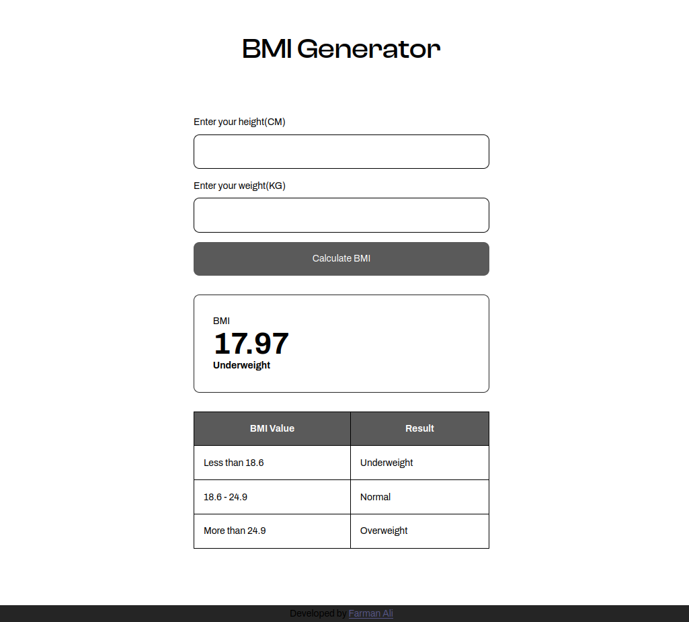

# ⚖️ BMI Generator

### 🔗 Live Link

- [🌐 Live Site](https://bmi-calculator6349.netlify.app/)
- [📂 GitHub Repo](https://github.com/farmanali6349/BMI_Calculator)

## 📌 Overview

This is a **simple and minimal BMI Calculator** that takes your **height** and **weight** as input and returns your **BMI (Body Mass Index)** along with a remark like _underweight_, _normal_, or _overweight_ based on standard health ranges.

The app is designed with **clarity and functionality in mind**, offering instant feedback to help users quickly check their health status.

✨ Key Features

1. 🧮 **BMI Calculation** – Automatically calculates your BMI based on input values.
2. 📊 **Health Remarks** – Displays if you are underweight, normal, or overweight.
3. 💬 **Instant Feedback** – Shows results immediately after input.
4. 💡 **Standard Ranges Used**:
   - **Less than 18.6** – Underweight
   - **18.6 – 24.9** – Normal
   - **More than 24.9** – Overweight
5. 🎯 **Minimal Design** – Focused on functionality and simplicity.
6. 📱 **Responsive Layout** – Works well on both desktop and mobile.

## 💬 Motivation

I built this project to **practice applying mathematical formulas** in JavaScript and to better understand how user input can be processed dynamically in the browser. The focus was entirely on functionality, not design — which gave me room to sharpen my logic and DOM manipulation skills.

## 🛠️ Tech Stack

- **HTML** – Input fields and layout
- **CSS** – Basic styling and layout structure
- **JavaScript** – Core BMI logic and DOM interaction
- **VS Code** – My go-to code editor

## 📸 Screenshot

## 🗓️ Published On

**Mar 3, 2024**
